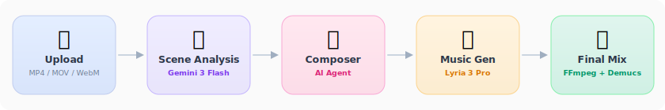
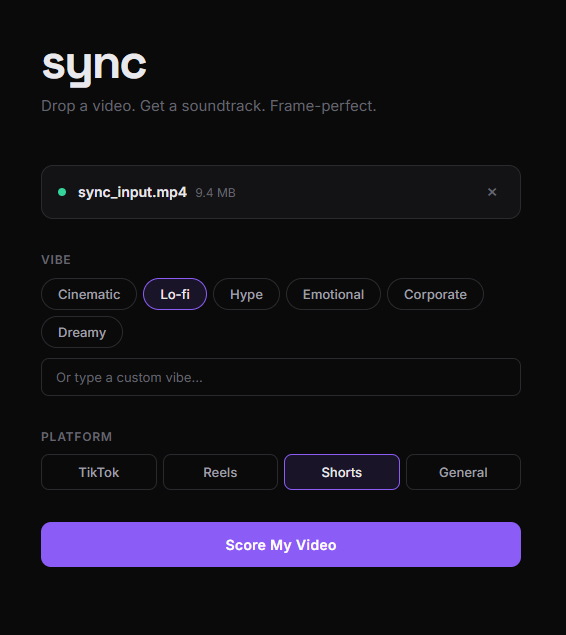
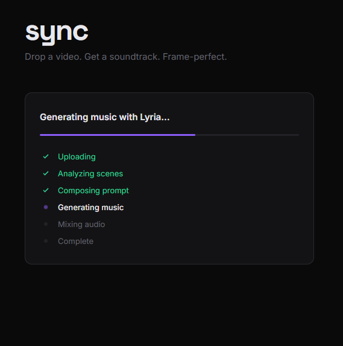
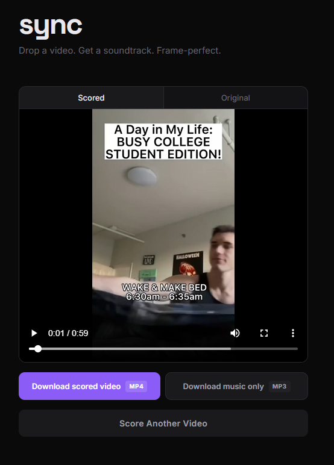

# sync

**Drop a short-form video. Get an original AI-composed soundtrack. Frame-perfect.**

Sync watches your video with AI, understands the mood and pacing of every scene, and composes a perfectly synced original score — then mixes it professionally and hands you the final video. No stock music. No licensing fees. No prompt writing. Just your video, scored.

### Before (original audio)


https://github.com/user-attachments/assets/1a6d468f-0b9e-40e8-b301-dcb84f48febf


### After (AI-scored with Sync)


https://github.com/user-attachments/assets/65a4ff30-e392-4d3a-a6a1-3850a83d30aa


> This 60-second college vlog already had background music — but it didn't match the energy of the visuals. Sync detected the existing audio, stripped the old music while preserving the creator's voice, analyzed the scene pacing, and composed a new original score that actually fits. Zero manual editing.
>
> Demo video by [Josh Slavin](https://www.youtube.com/@JoshSlavin/shorts), used with attribution for demonstration purposes only.

---

## Why This Exists

On March 25, 2026, Google launched **Lyria 3 Pro** — the first production-grade music generation API with timestamp-based structural control. The prompting guide was published on April 7. I built Sync the next day.

Before Lyria, there was no way to programmatically generate music that shifts precisely when scenes shift. You could generate a song, sure — but syncing it to visual cuts, mood changes, and energy arcs required a human composer. Timestamp prompting changed that. You can now write `[00:00] soft piano [00:15] add drums [00:30] full arrangement` and Lyria will nail the transitions.

Sync connects that capability to Gemini's native video understanding. Gemini watches your video at 1fps, identifies every scene change, detects dialogue, reads the energy arc — then a composer agent translates that analysis into a timestamp-formatted Lyria prompt. The result is music that feels like it was scored to picture, because it was.

**28 million YouTube channels need music for their videos.** Stock music is generic and expensive. Sync generates custom scores that fit perfectly, at $0.12 per video, built on licensed training data with no copyright risk.

---

## How It Works

### 1. Scene Analysis
Your video is uploaded to **Gemini 3 Flash**, which natively watches every frame and the audio track. It returns structured JSON: scene boundaries with timestamps, mood per scene, energy levels, camera movement, dominant colors, whether there's dialogue, and whether there's existing background music.

### 2. Prompt Composition
A **Composer Agent** (powered by Gemini) takes the scene analysis and your optional vibe preference, then thinks like a film composer. It outputs a timestamp-formatted prompt following the [Lyria prompting framework](https://cloud.google.com/blog/products/ai-machine-learning/ultimate-prompting-guide-for-lyria-3-pro): genre, mood, specific instruments, tempo, key — with `[MM:SS]` markers aligned to every scene boundary.

### 3. Music Generation
The prompt is sent to **Lyria 3 Pro**. The timestamp markers tell Lyria exactly when to shift the arrangement — soft intro here, build energy there, strip back for the ending. The output is a 48kHz stereo audio file, up to 3 minutes, with an inaudible SynthID watermark.

### 4. Final Mix
**FFmpeg** handles the professional assembly:
- **Duration matching** — if the music is shorter than the video, it's padded or looped; if longer, it's trimmed with a fade-out
- **Dialogue preservation** — if speech is detected, original audio stays at full volume and music sits at a consistent low level underneath (no volume jumps)
- **Vocal extraction** — if the video has speech *and* existing background music, **Demucs** (Meta's source separation model) extracts just the vocals, discards the old music, and mixes the clean speech with the new score
- **Smart replacement** — if the video has music but no speech, the old audio is replaced entirely with the new score
- **Sample rate normalization** — all audio is resampled to 48kHz before mixing to prevent artifacts

---

## Architecture

<p align="center">
  
</p>

---

## The App

<p align="center">
  
  &nbsp;&nbsp;
  
  &nbsp;&nbsp;
  
</p>

<p align="center">
  <em>Upload your video and pick a vibe &rarr; Watch the pipeline work in real-time &rarr; Preview and download the scored video</em>
</p>

---

## Tech Stack

| Layer | Technology | Why |
|-------|-----------|-----|
| Video Analysis | [Gemini 3 Flash](https://ai.google.dev/gemini-api/docs) | Native video understanding — no frame extraction needed |
| Music Generation | [Lyria 3 Pro](https://ai.google.dev/gemini-api/docs/music-generation) | Timestamp-synced structural control, 48kHz stereo output |
| Prompt Composition | Gemini 3 Flash | Creative reasoning to translate visual analysis into musical direction |
| Agent Pipeline | [LangGraph](https://github.com/langchain-ai/langgraph) | Stateful graph orchestration with progress tracking |
| Backend | [FastAPI](https://fastapi.tiangolo.com/) | Async API with background job processing |
| Audio Processing | [FFmpeg](https://ffmpeg.org/) | Industry-standard mixing, trimming, format conversion |
| Vocal Extraction | [Demucs](https://github.com/facebookresearch/demucs) (Meta) | AI source separation — isolates speech from background music |
| Frontend | [React](https://react.dev/) + [Vite](https://vite.dev/) | Drag-and-drop upload, live progress, before/after preview |

---

## Cost Per Video

```
Gemini 3 Flash (scene analysis + composer)  ~$0.03
Lyria 3 Pro (music generation)              ~$0.08
────────────────────────────────────────────
Total                                       ~$0.11
```

---

## Setup

### Prerequisites
- Python 3.10+
- Node.js 18+
- FFmpeg installed and in PATH
- Google AI API key from [aistudio.google.com](https://aistudio.google.com/apikey)

### Install

```bash
git clone https://github.com/LalithSaieChennam/sync.git
cd sync

# Backend
pip install -r requirements.txt
cp .env.example .env
# Add your GOOGLE_AI_API_KEY to .env

# Frontend
cd frontend
npm install
cd ..
```

### Run

```bash
# Terminal 1 — Backend
uvicorn backend.main:app --host 127.0.0.1 --port 8001

# Terminal 2 — Frontend
cd frontend
npx vite --port 5173
```

Open **http://localhost:5173**, drop a video, pick a vibe, and hit Score.

---

## Supported Input

| Format | Duration | Size | Audio |
|--------|----------|------|-------|
| MP4, MOV, WebM | 3s – 120s | Up to 100MB | Any (speech preserved, old music replaced) |

---

## Audio Mixing Modes

Sync automatically detects what's in your video's audio and handles it:

| Video Contains | What Sync Does |
|----------------|----------------|
| Speech + background music | Extracts vocals with Demucs, discards old music, mixes speech with new score |
| Speech only | Keeps original audio at full volume, new music at consistent low level underneath |
| Background music only | Replaces entirely with new score |
| Ambient sounds (nature, city) | Blends original 30% + new music 70% |
| No audio | New score at full volume |

---

## Vibe Presets

Pick a preset or type your own:

- **Cinematic** — orchestral, dramatic, wide dynamic range
- **Lo-fi** — warm, vinyl crackle, mellow beats
- **Hype** — high energy, bass-heavy, driving rhythm
- **Emotional** — piano-led, strings, bittersweet
- **Corporate** — clean, uplifting, professional
- **Dreamy** — ambient pads, ethereal, floating

Or type anything: *"dark trap with 808s"*, *"acoustic indie folk"*, *"90s boom-bap hip hop"*

---

## Limitations

- **Lyria 3 Pro is in preview** — API may change, rate limits apply during high demand
- **Artist name references blocked** — Lyria content-filters prompts that reference real artists. Describe the sound instead: "modern Tamil film score with electronic beats" not "like Anirudh"
- **Source separation isn't perfect** — Demucs extracts vocals well but some background music residue may bleed through on heavily mixed audio
- **2-minute generation cap** — Lyria currently generates up to ~2 minutes of audio, which fits the 15-120s short-form target perfectly
- **Timestamp sync is approximate** — music transitions align to the nearest second, not the exact frame. For short-form content this is imperceptible

---

## What's Next

- [ ] Rescore button — regenerate with a different vibe, one click
- [ ] Batch mode — score 10 videos at once
- [ ] Style reference upload — "make it sound like this track"
- [ ] Vocal support — AI-generated vocals with lyrics
- [ ] Mobile app
- [ ] API for integration into video editors (CapCut, DaVinci)
- [ ] Chrome extension — right-click any video, score it

---

## Demo Video

The example video in this repo is from [Josh Slavin's YouTube Shorts](https://www.youtube.com/@JoshSlavin/shorts). It is used here solely for demonstration purposes to show Sync's capabilities. All rights to the original video content belong to the creator. If you are the creator and would like this removed, please open an issue.

---

## License

MIT
